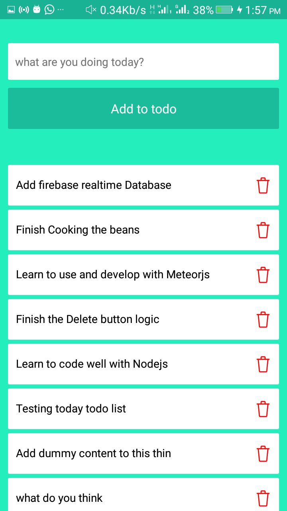
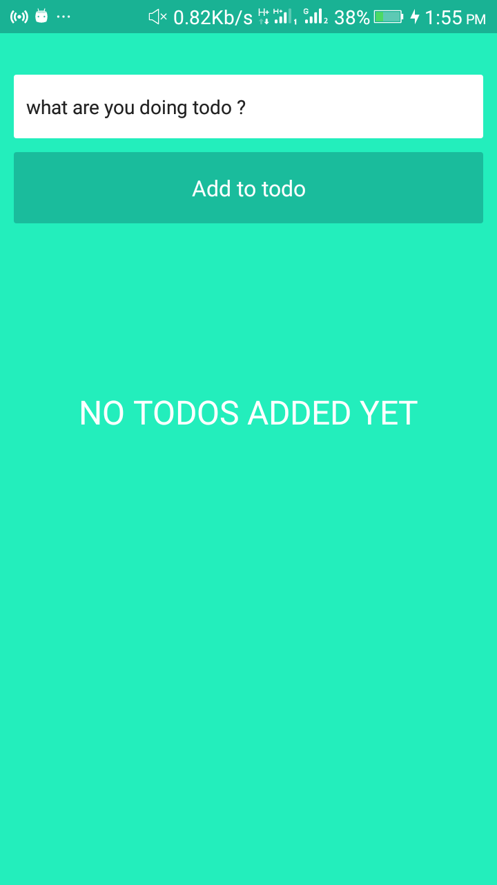

### A TODO LIST APP IN REACT-NATIVE WITH FIREBASE INTEGRATION

learning to use react-native, i created the almighty todo app
with firebase integration

### STEPS TO USING THIS PROJECT

* clone the repo or download it *

Run `yarn install`

cd into the directory and run `react-native run-android` or `react-native run-ios`
alongside, run `adb reverse tcp:8081 tcp:8081`

